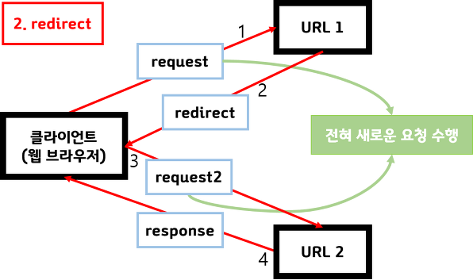

# 다형성

다형성이란?

&#x20;1.여러가지 형태를 가질 수 있는 것.

&#x20;2\. 하나의 메소드나 클래스가 있을 떄 이것들이 다양한 방법으로 동작하는 것. 대표적으로 오버로딩,오버라이딩이 있다.

&#x20;3\. 하나의 참조변수로 여러 타입의 객체를 참조할 수 있는 것.

&#x20;즉, 조상타입의 참조변수로 자손타입(상속관계)의 객체를 다룰 수 있는 것이 다형성의 기본 개념이다.

&#x20;주의점) 조상타입의 참조변수로 자손타입의 인스턴스를 참조할 수 있지만

&#x20;            반대로 자손타입의 참조변수로, 조상타입의 인스턴스를 참조할 수는 없다.&#x20;

