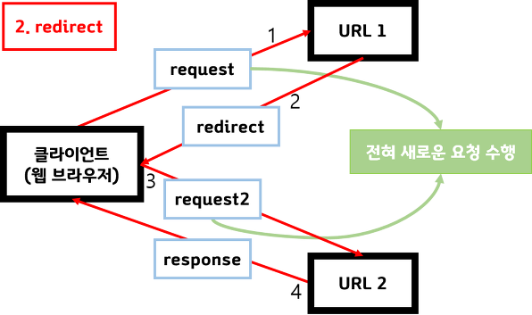

# redirect / forward

&#x20;고객은 Client, 상담원은 Server , 123,124번은 URL주소가 되겠다

&#x20;

**첫번째 사례 : forward**

1\. 고객이 123번을 누르고 고객센터의 상담원과 전화를 연결했다.

2\. 상담원이 문의사항을 몰라 다른 상담원에게 해당문의사항의 답을 얻는다.

3\. 상담원은 고객의 문의사항을 처리해준다.

&#x20;

**두번째 사례 : redirect**

1\. 고객이 123번을 누르고 고객센터의 상담원과 전화

를 연결했다.

2\. 상담원이 고객에게 말한다. "고객님 해당 문의사항은 124번을 누르셔서 다른 상담원에게 문의해주시겠어요"?

3\. 고객은 124번을 눌러서 다시 다른 상담원과 전화를 연결한다.

forward

.png>)

* Web Container 차원에서의 페이지 이동, 실제로 웹 브라우저는 다른 페이지로 이동 했는지 알 수 없다.(첫 번째 사례의 경우, 고객은 상담원이 어떤 상담원에게 물어봤는지 알 수 없다.)
* 웹 브라우저는 최초 호출한 URL만 표시되고, 이동한 페이지의 URL정보는 볼 수 없다.(첫 번째 사례의 경우, 고객은 123번으로만 전화 했기 때문이다.)
* **현재 실행중인 페이지와 forward에 의해 호출될 페이지는 request , response 객체를 공유한다.(고객이 요청한 문의 사항은 전화를 끊을 때까지 유효하다.)**

**forward방식은 다음으로 이동할 URL로 요청정보를 그대로 전달한다. 말 그대로 forward(건네주기) 하는 것이다.**&#x20;

**그렇기 때문에 사용자가 최초로 요청한 정보는 다음 URL 에서도 유효하다.**

****

**redirect**

********

****

* web container는 redirect 명령이 들어오면 웹 브라우저에게 다른 페이지로 이동하라는 명령을 내린다.(두번째 사례의 경우, 고객은 전화를 끊고 124번으로 다시 전화를 건다.)\

* 웹 브라우저는 URL을 지시된 주소로 바꾸고 그 주소로 이동한다.
* **새로운 페이지에서는 request,response 객체가 새롭게 생성된다. (123번에서 고객이 요청했던 문의사항은 124번으로 다시 걸어서 요청한 문의사항을 다시 말해야한다.)**

**redirect의 경우 최초 요청을 받은 URL1에서 클라이언트에 redirect할 URL2를 리턴하고, 클라이언트에게 새로운 요청을 생성하여 URL2에 다시 요청을 보낸다. 따라서 처음 보냈던 최초의 요청정보는 더이상 유효 하지 않다.**

****

**※결론**&#x20;

**첫째, URL의 변화(redirect : O / forward : X)**

**둘째객체의 재사용여부(redirect : X / forward : O)**

&#x20;****&#x20;
